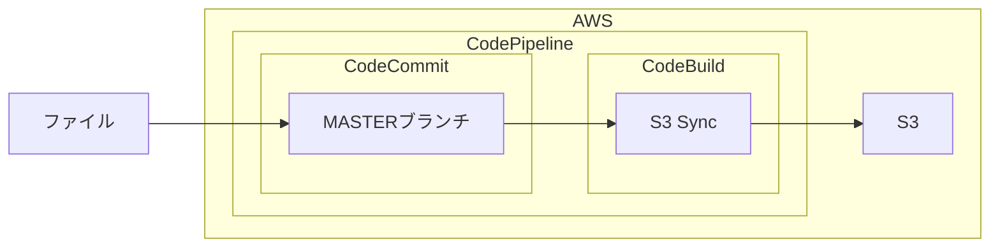

```mermaid
graph LR
    subgraph AWS
        subgraph CodePipeline
            subgraph CodeCommit
                A[MASTERブランチ]
            end
            subgraph CodeBuild
                B[S3 Sync]
            end
        end
        C[S3]
    end
    D[ファイル]-->A[MASTERブランチ]-->B[S3 Sync]-->C[S3]
```